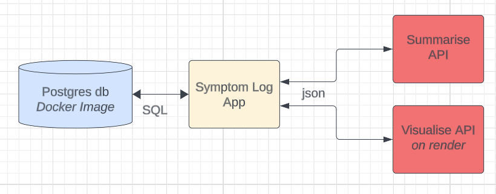

# Symptom Logger App v2.0

This application facilitates the logging of symptoms in free text, such as headaches or hip pain, over time. The accumulated symptom data can be concisely summarised, using a [**metaprompt**](./application/metaprompt.py) by AI for healthcare professionals or VETs. I used the **open ai playground** to experiment with 2 AI models; text-curie-001 and text-davinci-003, and develop my prompt. It was a really useful tool to compare the AI models aswell as manipulating my prompt.

### Update to v2.0
- My application has evolved from a single, large program (version 1.0) into a set of smaller, independent microservices. This change makes the application easier to work on and improve. I built this project as a demonstration of my ability to integrate different components like APIs, a database, and a user interface (Flask server), and how artificial intelligence (AI) can be incorporated into that mix.



The UI I've designed is just one piece of a more extensive application that allows users to describe their health symptoms in their own words. Once a user enters their symptoms, the application uses two different APIs: one to summarize the information and another to create visual charts or graphs of the symptoms.

# Run Requirements
### Database
- Requires the docker image of postgres, the [sql code](./application/static/scripts/database_create.sql ) in this repo
- Install the requirements
```bash
pip install -r requirements.txt
```
### Symptom Logger UI
- Run the app.py file to start the site locally on default port 5000
```bash
python -m flask run
```
### Symptom Logger Summarize API
- Run a second flask server on a different port, because the AI aspect costs me money each time it is run so it is not liberally deployed.
- Install the requirements
```bash
pip install -r requirement.txt
python -m flask run --port=5600
```
### Symptom Logger Visualize API
- This is deployed to render


## Challenges Overcome

1. **Adaptive Model Selection**: While experimenting with the **text-curie-001** AI model, a potential issue surfaced. The model delivered an excellent summary, but it deviated from the intended request, making an inference about the symptoms. Although precise, such inferencing could be inappropriate, as it should be conducted by a certified doctor or a medical AI tool, not by a symptom summarizer. The **text-davinci-003** AI model was superior and completed the task as required.

2. **Refining Intention Text**: The process of developing the model was engaging and time-consuming. An unforeseen adjustment was necessary: refining the intention text to narrow down the response suitably. Initially, the intention text was *'This summary is intended to be read by a doctor or a VET in order to make a diagnosis, an onward referral or prescribe treatment from these symptoms.'* This was eventually revised to *'This concise summary is intended to be spoken by a person trying to convey their symptoms using easy to understand language without clauses.'*

3. **Temporal Context Management**: Ensuring the model correctly interprets time-related context necessitated some strategizing. Specific text *'with a focus on change over time in symptoms, eg which are worsening or improving and whether the person experiences pain every day'* was incorporated into the prompt to compel the model to consider and comment on the progression of symptoms over time.

4. **Error Check File**: It was also helpful during the project to keep a .txt file to write down errors that I had researched so I could refer to that for the answers rather than re-researching all the errors every time I tore down and re-built the database.

___
### Key Considerations for App Development
- **Accuracy (Meta-prompt)**: 
    Current AI isn't infallible in summarizing reports, making knowledge of meta-prompts crucial for producing truthful and precise summaries.
- **User Engagement (UX)**: 
    Ensuring user-friendly and secure interfaces is essential to encourage comprehensive symptom reporting, thus enhancing user engagement and trust.
- **Data Privacy and Security Enforcement**: 
    Considering the sensitivity of health data, adherence to privacy regulations such as GDPR, HIPAA, among others, is critical. The deployment of robust encryption techniques and the following of data security best practices are required.
- **Accessibility Optimization**: 
    The app must cater to diverse user capabilities. This can be achieved by integrating accessible designs (including large text options and colorblind-friendly palettes) and supporting voice inputs.
- **Multilingual Support Expansion**: 
    To facilitate effective communication, the tool should also accommodate multiple languages.

### Limitiations
- **No Diagnostic Role**: This application merely facilitates patient-doctor communication and does not provide diagnoses or generate symptom-related information.
- **Non-medical Model**: The tool uses a language summarizing model, not medically trained, implying any medical expertise should come from the healthcare provider, not the application.
- **No Error Propagation**: Despite potential integration with medically trained AI, the tool aims to ensure clear patient-doctor communication, averting any risk of miscommunication akin to a 'Chinese Whispers' scenario.
